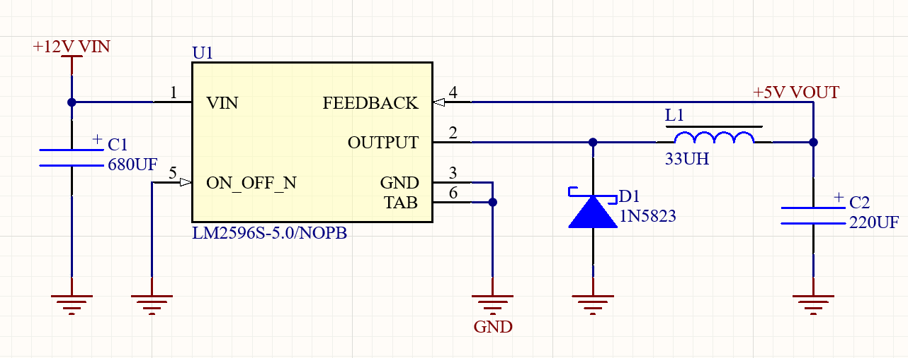
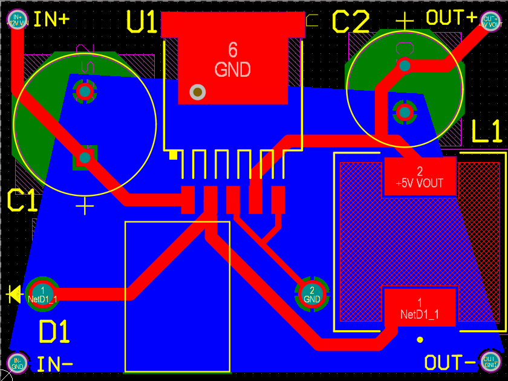
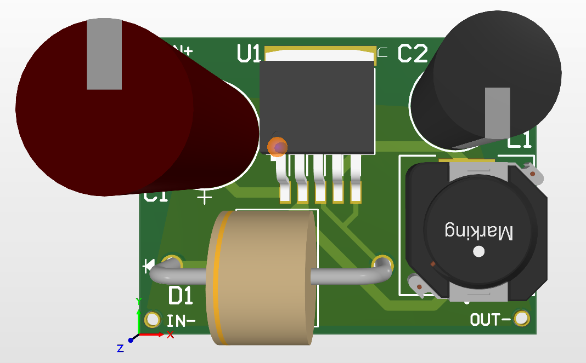
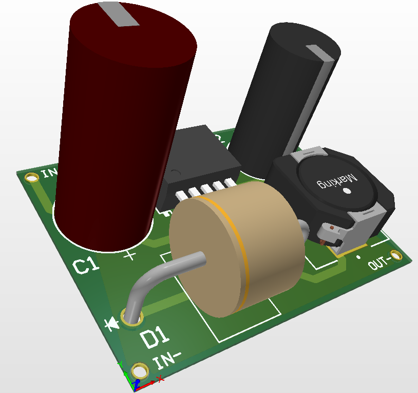

# Понижающий DC-DC преобразователь LM2596 — 12 В → 5 В / 3 А

Компактный двухслойный понижающий DC-DC преобразователь, разработанный в **Altium Designer**.

Проект выполнен на основе импульсного стабилизатора **LM2596S-5.0/NOPB** и предназначен для преобразования входного напряжения 12 В постоянного тока в выходное напряжение 5 В при токе нагрузки до 3 А.

---

## Основные характеристики

| Параметр | Значение |
|---|---|
| Входное напряжение | 12 В DC |
| Выходное напряжение | 5 В DC |
| Максимальный ток нагрузки | 3 А |
| Тип преобразователя | Понижающий (Buck / Step-Down) |
| Микросхема | LM2596S-5.0/NOPB |
| Частота переключения | 150 кГц |
| Количество слоёв PCB | 2 |
| Размер платы | 38 × 28 мм |
| САПР | Altium Designer |

---

## Принципиальная схема

Принципиальная схема построена на основе типового включения фиксированной версии **LM2596-5.0**.

Основные элементы силовой части:

- LM2596S-5.0/NOPB — импульсный стабилизатор;
- C1 — входной электролитический конденсатор 680 мкФ;
- C2 — выходной электролитический конденсатор 220 мкФ;
- L1 — силовой дроссель 33 мкГн;
- D1 — диод Шоттки 1N5823;
- входное напряжение — +12 В;
- выходное напряжение — +5 В.



---

## Печатная плата

Плата разработана как компактная двухслойная PCB размером **38 × 28 мм**.

При размещении компонентов основное внимание уделялось:

- минимальной длине силовых соединений;
- компактной площади импульсного контура;
- размещению входного конденсатора рядом с LM2596;
- короткому соединению между ключевым узлом, диодом и дросселем;
- короткому соединению обратной связи;
- использованию полигона GND на нижнем слое.



---

## 3D-модель платы

### Вид сверху



### Вид под углом



---

## Основные компоненты

| Обозначение | Компонент | Значение / Модель |
|---|---|---|
| U1 | Импульсный стабилизатор | LM2596S-5.0/NOPB |
| L1 | Силовой дроссель | 33 мкГн, Würth Elektronik 7447706330 |
| D1 | Диод Шоттки | 1N5823 |
| C1 | Входной конденсатор | 680 мкФ / 25 В |
| C2 | Выходной конденсатор | 220 мкФ / 35 В |

---

## Принцип работы

Преобразователь использует понижающую топологию **Buck**.

Основной силовой путь:

**+12 В → LM2596 → импульсный узел → L1 → +5 В**

LM2596 выполняет высокочастотное переключение силового ключа. Дроссель L1 и выходной конденсатор C2 обеспечивают фильтрацию импульсного напряжения и формирование постоянного выходного напряжения.

Диод Шоттки D1 обеспечивает путь тока во время выключенного состояния силового ключа.

Для версии **LM2596S-5.0** используется фиксированное выходное напряжение 5 В, поэтому внешний резистивный делитель для обратной связи не требуется.

Вывод FB подключён непосредственно к выходной цепи +5 В.

---

## Конструкция печатной платы

Плата выполнена в двухслойном исполнении.

На верхнем слое размещены основные компоненты и силовые соединения. Нижний слой используется преимущественно для формирования общего проводника **GND** с помощью медного полигона.

Особое внимание уделено силовому импульсному узлу:

**U1 → D1 / L1**

Это позволяет уменьшить длину токовых петель и паразитные индуктивности соединений.

---

## Проверка проекта

Проект был проверен средствами **Altium Designer**.

Выполнены:

- проверка электрических соединений;
- компиляция проекта;
- проверка печатной платы;
- Design Rule Check (DRC).

Результат финальной проверки PCB:

**DRC: 0 ошибок**

---

## Программное обеспечение

Для разработки использовался:

- **Altium Designer**

В проекте выполнены:

- разработка принципиальной схемы;
- создание и настройка компонентов;
- разработка печатной платы;
- размещение компонентов;
- трассировка;
- создание полигона GND;
- 3D-визуализация;
- проверка DRC.

---

## Структура проекта

```text
LM2596-Buck-Converter/
│
├── Altium/
│   ├── LM2596_Buck_Converter.PrjPcb
│   ├── LM2596_Buck_Converter.SchDoc
│   ├── LM2596_Buck_Converter.PcbDoc
│   └── Libraries/
│
├── Renders/
│   ├── schematic.png
│   ├── pcb_2d.png
│   ├── pcb_3d_top.png
│   └── pcb_3d_angle.png
│
├── BOM/
│   └── BOM.xlsx
│
├── Documentation/
│   └── LM2596_Buck_Converter_Portfolio.docx
│
└── README.md
